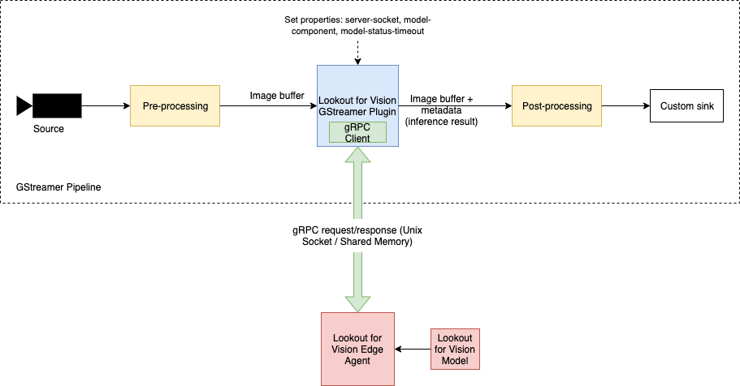

## GStreamer for LookoutForVision - `aws.greengrass.labs.lookoutvision.GStreamer`

## Overview

This AWS IoT Greengrass component provides a GStreamer plugin that enables you to perform Lookout for Vision 
anomaly detection in your custom GStreamer pipelines. This plugin takes the image buffer and sends it to Lookout for 
Vision Edge Agent and gets back the inference result as response.

This GStreamer plugin is essentially a client to Lookout for Vision Edge Agent running on edge device. The Edge Agent 
serves inferences over gRPC protocol. The corresponding gRPC client is built into the plugin's shared object binary. 
This plugin receives the image buffer at its sink pad, gets inference results for the image buffer over gRPC 
request/response and attaches the inference results to the image buffer before propagating it downstream through its 
source pad.

## Prerequisite Setup

* A Greengrass V2 core device - See
[Install the AWS IoT Greengrass Core software](https://docs.aws.amazon.com/greengrass/v2/developerguide/install-greengrass-core-v2.html).
* GStreamer - For NVIDIA devices, Jetpack comes pre-installed with GStreamer. If it is not installed, follow these 
[instructions](https://gstreamer.freedesktop.org/documentation/installing/on-linux.html?gi-language=c) to install GStreamer.
* Amazon Lookout for Vision Edge Agent Greengrass component (`aws.iot.lookoutvision.EdgeAgent`) and Lookout for Vision 
model Greengrass component (created through Lookout for Vision's model export API) deployed to the Greengrass core device.
* AWS Command Line Interface (CLI) - See 
[Installing or updating the latest version of the AWS CLI](https://docs.aws.amazon.com/cli/latest/userguide/getting-started-install.html).
* CMake - 3.14.0 or later

## Architecture


## Quick Setup
You can either follow this quick setup or skip this and go to [Build](#build) and proceed from there.

1. Set up GDK CLI - See [Greengrass Development Kit - Command Line Interface](https://github.com/aws-greengrass/aws-greengrass-gdk-cli).
2. Initialize GStreamer for LookoutForVision project.  
   `gdk component init --repository aws-greengrass-labs-lookoutvision-gstreamer`
3. Build the artifact and recipe of the component.  
   `gdk component build`
4. Replace placeholders `<PLACEHOLDER BUCKET HERE>` and `<PLACEHOLDER REGION HERE>` with your S3 bucket name and region 
   respectively in gdk-config.json. Create new version of component in your AWS account.  
   `gdk component publish`

If you have completed this quick setup, you can skip [Build](#build) and [Greengrass Component](#greengrass-component) 
sections and directly jump to [Deployment](#deployment).

## Build
### Download
To download run the following command:

`git clone https://github.com/awslabs/aws-greengrass-labs-lookoutvision-gstreamer.git`

### Configure
Prepare a build directory inside the newly checked out repository:
```
mkdir -p build
cd build
```
Inside the build directory, run `cmake ..`.

#### CMake Arguments
You can pass the following options to `cmake ..`.
* `-DBUILD_TEST=ON` -- Build unit/integration tests, may be useful to confirm support for your device
* `-DUSE_SHARED_MEMORY=ON` --  Enable POSIX shared memory implementation for transferring image to Lookout for Vision 
Edge Agent component for inference

#### Shared Memory
POSIX Shared Memory implementation is not built by default. The default implementation sends image bitmap for inference 
in the gRPC protobuf message. To enable image transfer through shared memory segment, add `-DUSE_SHARED_MEMORY=ON` when 
running cmake:
```
cmake -DUSE_SHARED_MEMORY=ON ..
```

### Compiling
After running cmake, in the same build directory run `make`:
```
make
```
In your build directory you will now have the shared object binary `libgstlookoutvision.so`.

## Greengrass Component
Upload the built binary `libgstlookoutvision.so` to S3 location 
`s3://<BUCKETNAME>/artifacts/aws.greengrass.labs.lookoutvision.GStreamer/1.0.0/libgstlookoutvision.so`. 
Replace `<BUCKETNAME>` with your s3 bucket name. In the build directory, run:
```
aws s3 cp libgstlookoutvision.so \
  s3://<BUCKETNAME>/artifacts/aws.greengrass.labs.lookoutvision.GStreamer/1.0.0/libgstlookoutvision.so
```

Create a private Greengrass component `aws.greengrass.labs.lookoutvision.GStreamer` with the `recipe.json` file in 
project root. Replace `<BUCKETNAME>` in recipe with the s3 bucket name used in previous step and run from project root:
```
aws greengrassv2 create-component-version --inline-recipe fileb://recipe.json
```

_Refer [Develop AWS IoT Greengrass components](https://docs.aws.amazon.com/greengrass/v2/developerguide/develop-greengrass-components.html) 
for detailed instructions on creating a Greengrass component._

## Deployment
Add the component `aws.greengrass.labs.lookoutvision.GStreamer` to your existing Greengrass deployment with Lookout for 
Vision components. Once deployed, verify that it is in the FINISHED state:
```
## Command
sudo /greengrass/v2/bin/greengrass-cli component list

## Command prints installed components (should contain aws.greengrass.labs.lookoutvision.GStreamer)
Components currently running in Greengrass:
Component Name: aws.greengrass.labs.lookoutvision.GStreamer
    Version: 1.0.0
    State: FINISHED
    Configuration: {}
```

## Run
### Loading Element
Once this Greengrass component is deployed, the GStreamer plugin is located under `/greengrass/v2` directory.

Consume the `lookoutvision` element in a custom GStreamer pipeline. Replace values for `server-socket` and 
`model-component` properties of lookoutvision element.
```
gst-launch-1.0 \
  videotestsrc num-buffers=1 pattern=ball \
  ! 'video/x-raw, format=RGB, width=1280, height=720' \
  ! videoconvert \
  ! lookoutvision server-socket=unix:///tmp/aws.iot.lookoutvision.EdgeAgent.sock model-component=SampleComponentName \
  ! videoconvert \
  ! jpegenc \
  ! filesink location=./anomaly.jpg \
  --gst-plugin-path=/greengrass/v2/

## Output will contain inference result of the form
Is Anomalous? 1, Confidence: 0.52559
```
Note: You will need to allow current user to read and write from the Lookout for Vision Edge Agent socket by running 
(replace with configured socket):
```
chmod a+rw /tmp/aws.iot.lookoutvision.EdgeAgent.sock
```

### Element Properties
The lookoutvision element has the following properties:
* `server-socket` -- Unix domain socket on which the gRPC server in Edge Agent component is running 
(Default value: unix:///tmp/aws.iot.lookoutvision.EdgeAgent.sock)
* `model-component` -- Name of model component exported through Lookout for Vision's model export API and deployed on 
the device (No default value - MUST be set for inference to run)
* `model-status-timeout` -- Timeout in seconds to wait for model status when the lookoutvision element starts model 
using gRPC StartModel API (Default value: 180)

### Input/Output
The lookoutvision element receives RGB image buffers as input at its sink pad. After getting inference result for the 
image buffer from Lookout for Vision Edge Agent, it attaches the inference results to the input image buffer as metadata 
and propagates it downstream through its source pad. We define the following GstMeta implementation for Lookout for 
Vision inference result:
```
typedef struct _GstLookoutVisionMeta {
    GstMeta meta;

    GstLookoutVisionResult* result;
} GstLookoutVisionMeta;
```
For reading this inference result in a custom downstream plugin, include 
[gstlookoutvisionmeta.h](https://github.com/awslabs/aws-greengrass-labs-lookoutvision-gstreamer/blob/main/src/gst/lookoutvisionmeta/gstlookoutvisionmeta.h)
in your plugin source and call `gst_buffer_get_lookout_vision_meta` as demonstrated by 
[mqttpublisher](https://github.com/awslabs/aws-greengrass-labs-lookoutvision-gstreamer/blob/main/mqtt-publish-sample/mqttpublisher-gstreamer-plugin/mqttpublisher/gstmqttpublisher.cc) 
plugin in the sample application we provide.

## Sample Application
We provide a sample application based on this GStreamer plugin. Follow the instructions in sample's 
[README](https://github.com/awslabs/aws-greengrass-labs-lookoutvision-gstreamer/tree/main/mqtt-publish-sample) to set up 
and run.

## Security

See [CONTRIBUTING](CONTRIBUTING.md#security-issue-notifications) for more information.

## License

This project is licensed under the Apache-2.0 License.

## Troubleshooting

*
  ```
  WARNING: erroneous pipeline: no element "lookoutvision"
  ```
Make sure to specify `--gst-plugin-path=/greengrass/v2/` when running GStreamer pipeline. Also make sure the component 
aws.greengrass.labs.lookoutvision.GStreamer is in FINISHED state.

*
  ```
  StartModel returned error 14: failed to connect to all addresses
  DescribeModel failed with error 14: failed to connect to all addresses
  ```
Make sure Lookout for Vision Edge Agent is RUNNING. Verify that you're using the correct value of `server-socket` when 
running the GStreamer pipeline. Also make sure you have read and write access to the socket (replace with configured 
socket): `chmod a+rw /tmp/aws.iot.lookoutvision.EdgeAgent.sock`.

*
  ```
  Model didn't reach RUNNING state within 180 seconds
  ```
Try with increased timeout by setting the property `model-status-timeout` to a higher value.

*
  ```
  StartModel returned error 9: Amazon Lookout for VisionEdge Agent can't perform the operation. The model is RUNNING.
  ```
No action required. Model is already running and will be able to perform inferences.
