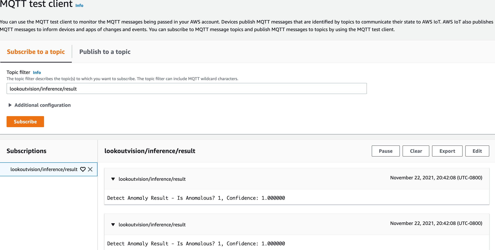

## Sample Application - MQTT Publisher

## Overview

Here, we create a sample application that publishes Lookout for Vision inference results to an IoT MQTT topic. In 
addition to the lookoutvision GStreamer plugin, this comprises two additional Greengrass components:

1. mqttpublisher GStreamer plugin - `aws.greengrass.labs.mqttpublisher.GStreamer`
2. GStreamer pipeline consuming lookoutvision, mqttpublisher and other GStreamer plugins - `aws.greengrass.labs.GStreamerPipeline`

## mqttpublisher GStreamer plugin
This element extracts the inference result from buffer (that was attached as metadata by lookoutvision) and publishes 
to a configurable IoT MQTT topic. It uses [AWS IoT Device SDK for C++ v2](https://github.com/aws/aws-iot-device-sdk-cpp-v2)
to route MQTT messages to IoT Core via Greengrass IPC.

### Build
#### Build AWS IoT Device SDK
```
mkdir ~/sdk-cpp-workspace
cd ~/sdk-cpp-workspace
git clone --recursive https://github.com/aws/aws-iot-device-sdk-cpp-v2.git
mkdir -p build
cd build
cmake -DCMAKE_BUILD_TYPE="Release" ../aws-iot-device-sdk-cpp-v2
cmake --build . --target install
```
_See [Installation](https://github.com/aws/aws-iot-device-sdk-cpp-v2#Installation) for details._  
Subsequent steps assume the SDK is built in `~/sdk-cpp-workspace/build` directory.

#### Build GStreamer plugin
CD into `mqtt-publish-sample/mqttpublisher-gstreamer-plugin` and run:
```
mkdir -p build
cd build
cmake -DCMAKE_PREFIX_PATH="~/sdk-cpp-workspace/build" ..
make
```
In the build directory you will now have the shared object binary `libgstmqttpublisher.so`.

### Greengrass Component
Upload the built binary `libgstmqttpublisher.so` to S3 location
`s3://<BUCKETNAME>/artifacts/aws.greengrass.labs.mqttpublisher.GStreamer/1.0.0/libgstmqttpublisher.so`.
Replace `<BUCKETNAME>` with your s3 bucket name. In the build directory, run:
```
aws s3 cp libgstmqttpublisher.so \
  s3://<BUCKETNAME>/artifacts/aws.greengrass.labs.mqttpublisher.GStreamer/1.0.0/libgstmqttpublisher.so
```

Create a private Greengrass component `aws.greengrass.labs.mqttpublisher.GStreamer` with the recipe at
`mqtt-publish-sample/mqttpublisher-gstreamer-plugin/recipe/aws.greengrass.labs.mqttpublisher.GStreamer-1.0.0.json`. 
Replace `<BUCKETNAME>` in recipe with the s3 bucket name used in previous step and run from project root:
```
aws greengrassv2 create-component-version --inline-recipe \
  fileb://mqtt-publish-sample/mqttpublisher-gstreamer-plugin/recipe/aws.greengrass.labs.mqttpublisher.GStreamer-1.0.0.json
```

_Refer [Develop AWS IoT Greengrass components](https://docs.aws.amazon.com/greengrass/v2/developerguide/develop-greengrass-components.html)
for detailed instructions on creating a Greengrass component._

## GStreamer Pipeline
This Greengrass component runs following GStreamer pipeline linking lookoutvision and mqttpublisher elements along with 
other elements
```
gst-launch-1.0 \
  videotestsrc num-buffers=10 pattern=ball \
  ! 'video/x-raw, format=RGB, width=1280, height=720' \
  ! videoconvert \
  ! lookoutvision server-socket=unix:///tmp/aws.iot.lookoutvision.EdgeAgent.sock model-component=SampleComponentName \
  ! mqttpublisher publish-topic=lookoutvision/inference/result \
  ! videoconvert \
  ! jpegenc \
  ! filesink location=./anomaly.jpg \
  --gst-plugin-path=/greengrass/v2/
```
Modify the pipeline in the recipe at `mqtt-publish-sample/gstreamer-pipeline/recipe/aws.greengrass.labs.GStreamerPipeline-1.0.0.json`.
Modify the pipeline elements based on the camera source, display sink, and other preprocessing and postprocessing as 
needed. Replace values for `server-socket` and `model-component` properties of lookoutvision element, and `publish-topic`
property of mqttpublisher element.  

Note: This GStreamer pipeline (comprising mqttpublisher) can only be run as a Greengrass component because mqttpublisher 
uses greengrass IPC to route MQTT messages to IoT Core.

### Greengrass Component
After making required modifications to pipeline in the _run_ lifecycle of recipe, create a private Greengrass component 
`aws.greengrass.labs.GStreamerPipeline`. Run from project root:
```
aws greengrassv2 create-component-version --inline-recipe \
  fileb://mqtt-publish-sample/gstreamer-pipeline/recipe/aws.greengrass.labs.GStreamerPipeline-1.0.0.json
```

### Deployment
Create a Greengrass deployment with `aws.greengrass.labs.GStreamerPipeline` and Lookout for Vision model component. The 
other components `aws.iot.lookoutvision.EdgeAgent`, `aws.greengrass.labs.lookoutvision.GStreamer` and 
`aws.greengrass.labs.mqttpublisher.GStreamer` will be automatically brought in as their dependencies.  

Once deployed, verify the states of components:
```
## Command
sudo /greengrass/v2/bin/greengrass-cli component list

## Command prints installed components
Components currently running in Greengrass:
Component Name: aws.greengrass.labs.GStreamerPipeline
    Version: 1.0.0
    State:RUNNING
    Configuration: {}
Component Name: aws.greengrass.labs.lookoutvision.GStreamer
    Version: 1.0.0
    State: FINISHED
    Configuration: {}
Component Name: aws.greengrass.labs.mqttpublisher.GStreamer
    Version: 1.0.0
    State: FINISHED
    Configuration: {}
```

### Test
In IoT console, subscribe to MQTT topic lookoutvision/inference/result (or whichever topic you configured while modifying 
pipeline). You will see messages of this form being published:



## Troubleshooting

*
  ```
  CMake Error at CMakeLists.txt:42 (add_library):
    Target "GreengrassClient" links to target "AWS::GreengrassIpc-cpp" but the
    target was not found.  Perhaps a find_package() call is missing for an
    IMPORTED target, or an ALIAS target is missing?
  ```
The cmake build of mqttpublisher looks for AWS IoT Device SDK in `~/sdk-cpp-workspace/build` directory, so make sure SDK 
is built in that directory.

*
  ```
  Failed to establish IPC connection: EVENT_STREAM_RPC_NULL_PARAMETER
  ```
Since the GStreamer pipeline in this sample comprises mqttpublisher, it can only be run as a Greengrass component 
because mqttpublisher uses greengrass IPC to route MQTT messages to IoT Core. So make sure you're not running the 
pipeline outside of Greengrass.
